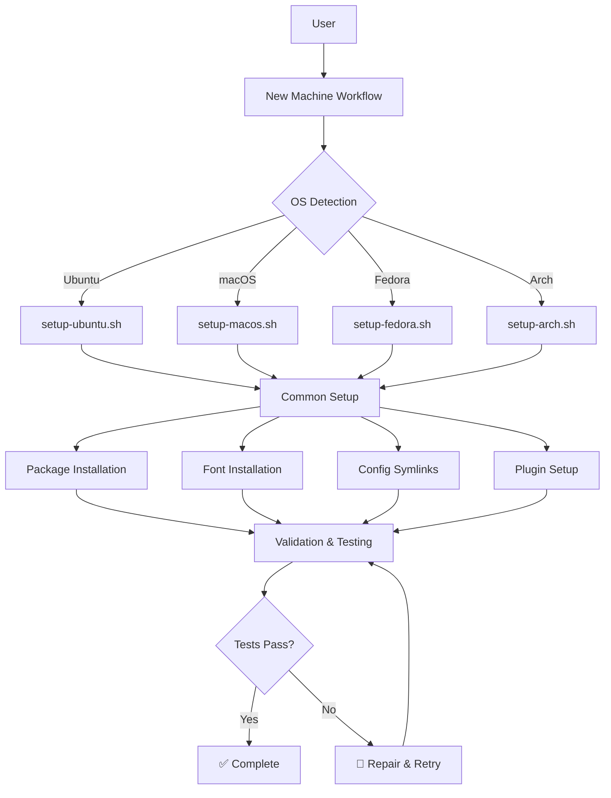
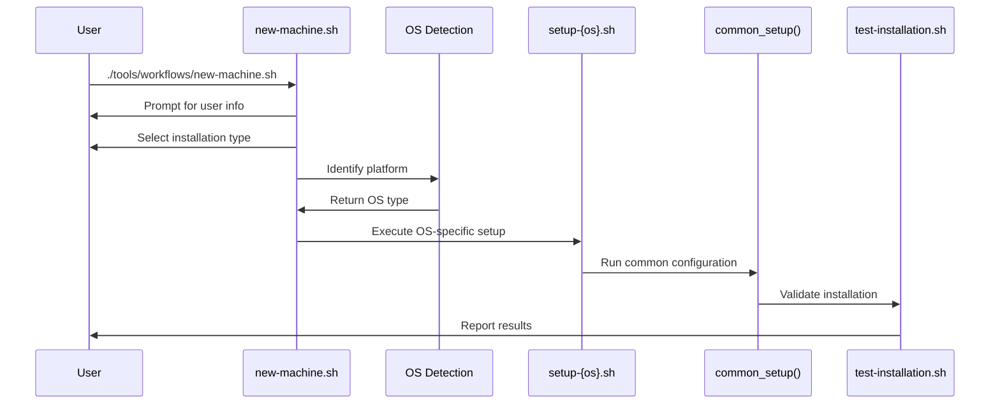
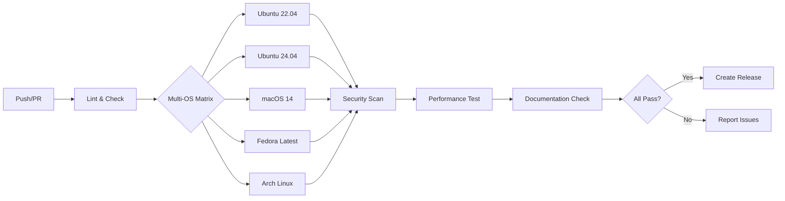
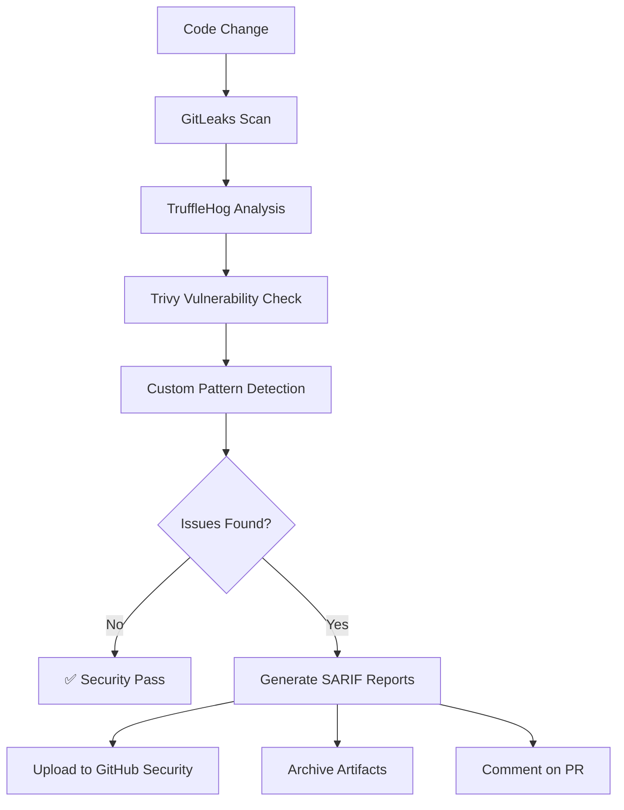

# 🏗️ Dotfiles Architecture

This document describes the architecture, design decisions, and implementation details of the modern cross-platform dotfiles system.

## 🎯 Design Philosophy

### Core Principles
- **🌍 Cross-Platform First**: Work seamlessly across Ubuntu, macOS, Fedora, and Arch Linux
- **🤖 Automation-Driven**: Minimal manual intervention with intelligent defaults
- **🛡️ Security-Focused**: Comprehensive scanning and validation at every step
- **🧪 Test-Driven**: Every change validated across multiple platforms via CI/CD
- **📦 Modular Design**: Clean separation of concerns with extensible architecture

### Quality Assurance
- **Multi-OS Testing**: Automated validation on 4 major platforms
- **Security Scanning**: 4 integrated security tools (GitLeaks, TruffleHog, Trivy, custom)
- **Performance Monitoring**: Startup time and resource usage optimization
- **Documentation-Driven**: Comprehensive guides with living examples

## 🏗️ System Architecture



## 📁 Directory Structure

```
dotfiles/
├── 🔄 .github/workflows/     # CI/CD automation
│   └── ci.yml               # Multi-OS testing & security
│
├── 📋 docs/                 # Comprehensive documentation
│   ├── INSTALLATION.md      # Setup instructions
│   ├── CUSTOMIZATION.md     # User guide
│   ├── TROUBLESHOOTING.md   # Problem resolution
│   └── ARCHITECTURE.md      # This document
│
├── ⚙️ config/               # Configuration templates
│   ├── zsh/                # Shell configuration
│   │   ├── aliases.zsh      # 200+ command aliases
│   │   ├── functions.zsh    # 50+ utility functions
│   │   ├── exports.zsh      # Environment variables
│   │   └── distro.zsh      # OS-specific configs
│   ├── vim/                # Editor configuration
│   ├── tmux/               # Terminal multiplexer
│   ├── git/                # Version control
│   └── kitty/              # Terminal emulator
│
├── 🛠️ scripts/              # Installation & maintenance
│   ├── setup/              # OS-specific installers
│   │   ├── setup-ubuntu.sh  # Ubuntu + container support
│   │   ├── setup-macos.sh   # Homebrew + native tools
│   │   ├── setup-fedora.sh  # DNF + Flatpak + RPM Fusion
│   │   └── setup-arch.sh    # Pacman + AUR via yay
│   ├── install/            # Component installers
│   │   ├── install-fonts.sh # Nerd Fonts collection
│   │   ├── install-cli-tools.sh # Modern CLI arsenal
│   │   └── install-dev-tools.sh # Development environments
│   ├── utils/              # Utility scripts
│   │   ├── create-symlinks.sh # Configuration linking
│   │   ├── backup-dotfiles.sh # Configuration backup
│   │   └── cleanup.sh        # System maintenance
│   └── maintenance/        # Ongoing maintenance
│       ├── update-all.sh    # Update everything
│       └── cleanup.sh       # Clean unused packages
│
├── 🧪 tests/                # Validation framework
│   └── test-installation.sh # 17-test comprehensive suite
│
├── 🎯 tools/workflows/      # User-facing workflows
│   ├── new-machine.sh      # Interactive setup wizard
│   ├── doctor.sh           # Health check & diagnostics
│   └── bootstrap.sh        # Minimal bootstrap
│
├── 🎨 fonts/               # Font collections
│   ├── MesloLGS/          # Primary terminal font
│   ├── FiraCode/          # Programming font with ligatures
│   ├── JetBrainsMono/     # Modern development font
│   └── Hack/              # Classic programming font
│
└── 📋 templates/           # Configuration templates
    ├── .gitconfig.template # Git configuration
    └── ssh-config.template # SSH client configuration
```

## 🔄 Workflow Architecture

### 1. 🎯 New Machine Setup Flow



### 2. 🧪 CI/CD Testing Pipeline



### 3. 🛡️ Security Scanning Flow



## 🧩 Component Architecture

### OS Detection System

**Multi-Method Detection Approach:**
```bash
# Priority order for reliability
1. /etc/os-release (standard)
2. lsb_release -si (if available)  
3. /etc/issue (fallback)
4. CI environment detection
5. Package manager detection
```

**Container-Aware Design:**
- Detects CI environments (`CI=true`)
- Handles missing standard tools in containers
- Graceful degradation for minimal environments
- Special handling for Docker/GitHub Actions

### Package Management Abstraction

**Unified Interface:**
```bash
install_package() {
    case "$OS_TYPE" in
        "ubuntu"|"debian") apt_install "$@" ;;
        "macos") brew_install "$@" ;;
        "fedora") dnf_install "$@" ;;
        "arch") pacman_install "$@" ;;
    esac
}
```

**Platform-Specific Optimizations:**
- **Ubuntu**: APT + Snap + PPA support
- **macOS**: Homebrew + Mac App Store integration  
- **Fedora**: DNF + Flatpak + RPM Fusion repos
- **Arch**: Pacman + AUR via yay helper

### Configuration Management

**Symlink Strategy:**
```bash
# Atomic symlink creation with backup
create_symlink() {
    local source="$1"
    local target="$2"
    
    [[ -e "$target" ]] && backup_file "$target"
    ln -sf "$source" "$target"
    validate_symlink "$target"
}
```

**Modular Loading System:**
```bash
# Zsh loading order (critical for functionality)
1. exports.zsh    # Environment setup
2. functions.zsh  # Function definitions  
3. aliases.zsh    # Command aliases
4. distro.zsh     # OS-specific configurations
5. local.zsh      # User customizations
```

### Plugin Management Architecture

**Oh My Zsh Integration:**
```bash
# Essential plugin set
plugins=(
    git                     # Git workflow enhancements
    zsh-autosuggestions    # Command completion
    zsh-syntax-highlighting # Syntax coloring
    fast-syntax-highlighting # Performance-optimized highlighting
    zsh-autocomplete       # Advanced completion system
)
```

**Installation Flow:**
1. Install Oh My Zsh framework
2. Clone custom plugins to `$ZSH_CUSTOM/plugins/`
3. Configure plugin loading in `.zshrc`
4. Validate plugin functionality

## 🧪 Testing Architecture

### Test Categories

**17 Comprehensive Tests:**
1. **Essential Commands** - Core tool availability
2. **Modern CLI Tools** - Enhanced utilities
3. **Core Symlinks** - Configuration linking
4. **Config Directories** - Directory structure
5. **Zsh Configuration** - Shell setup validation
6. **Vim Configuration** - Editor functionality
7. **Tmux Configuration** - Terminal multiplexer
8. **Git Configuration** - Version control setup
9. **Shell Plugins** - Plugin functionality
10. **Starship Prompt** - Modern prompt system
11. **SSH Configuration** - Secure shell setup
12. **Font Installation** - Typography support
13. **Environment Variables** - System environment
14. **Script Permissions** - Security validation
15. **CI/CD Compatibility** - Automation support
16. **Performance Check** - Speed optimization
17. **System Health** - Overall status

### CI-Aware Testing

**Environment Adaptation:**
```bash
# Test behavior changes based on environment
if [[ "${CI:-}" == "true" ]]; then
    # CI Mode: Test tool availability, not configurations
    test_tool_installation
else
    # Local Mode: Test full configuration and symlinks
    test_full_installation
fi
```

**Smart Failure Handling:**
- **CI Environment**: Skip symlink/config tests (not created in CI)
- **Local Environment**: Full validation including user configurations
- **Container Environment**: Adapted expectations for minimal systems

### Performance Monitoring

**Metrics Collection:**
- **Shell Startup Time**: Zsh initialization benchmarks
- **Command Response**: Tool execution timing
- **Memory Usage**: Resource consumption monitoring
- **Plugin Load Time**: Individual component performance

## 🛡️ Security Architecture

### Multi-Tool Scanning Strategy

**Layered Security Approach:**
1. **GitLeaks** - Git repository secret scanning
2. **TruffleHog** - Advanced entropy-based detection
3. **Trivy** - Vulnerability and secret analysis
4. **Custom Patterns** - Dotfiles-specific checks

**Scan Coverage:**
- **Repository History** - Full git history analysis
- **Configuration Files** - Dotfile security validation
- **Dependencies** - Package vulnerability assessment
- **Custom Patterns** - Password/key pattern detection

### SARIF Integration

**GitHub Security Tab Integration:**
```yaml
# Automated security reporting
- Upload vulnerability results
- Upload secret detection results  
- Generate security summaries
- Archive detailed reports
```

**Fallback Strategy:**
- **Primary**: Upload to GitHub Security tab
- **Fallback**: Preserve as workflow artifacts
- **Summary**: GitHub Step Summary with key metrics
- **PR Comments**: Automated security status reporting

## 🔧 Extensibility Architecture

### Plugin System Design

**Modular Extension Points:**
- **OS Support**: Add new `setup-{distro}.sh` scripts
- **Tools**: Extend `install-{component}.sh` scripts  
- **Configurations**: Add new config directories
- **Tests**: Extend test framework with new validations

### Configuration Override System

**Hierarchy (highest to lowest priority):**
1. **Local overrides** - `~/.config/local/`
2. **User customizations** - `~/.{tool}rc.local`
3. **Dotfiles defaults** - Repository configurations
4. **System defaults** - Tool default configurations

### Development Workflow

**Contribution Process:**
1. **Fork & Branch** - Create feature branch
2. **Develop & Test** - Local development and validation
3. **CI Validation** - Automated multi-platform testing
4. **Security Scan** - Automated security validation
5. **Documentation** - Update relevant documentation
6. **Review & Merge** - Code review and integration

## 📊 Monitoring & Observability

### CI/CD Metrics

**Automated Collection:**
- **Build Success Rate** - Platform-specific success metrics
- **Test Coverage** - Validation test results
- **Security Issues** - Security scan findings
- **Performance Metrics** - Speed and resource usage

### Health Monitoring

**System Health Indicators:**
- **Tool Availability** - Essential command presence
- **Configuration Validity** - Syntax and structure validation
- **Performance Baselines** - Startup time and responsiveness
- **Security Posture** - Active vulnerability status

### Reporting Dashboard

**GitHub Integration:**
- **Actions Summary** - CI/CD pipeline results
- **Security Tab** - Vulnerability and secret findings
- **Release Notes** - Automated changelog generation
- **Artifact Storage** - Detailed result preservation

## 🚀 Performance Optimization

### Loading Optimization

**Lazy Loading Strategy:**
```bash
# Defer expensive operations until needed
lazy_load_nvm() {
    unset -f nvm node npm
    # Load NVM only when first used
}
```

**Caching Systems:**
- **Command Completion** - Cache completion results
- **Tool Detection** - Cache tool availability checks
- **Environment Setup** - Cache environment variable computation

### Resource Management

**Memory Optimization:**
- **Plugin Pruning** - Only load essential plugins
- **History Management** - Efficient history storage and retrieval  
- **Completion Caching** - Smart completion result caching

**Startup Time Optimization:**
- **Conditional Loading** - Load features only when needed
- **Parallel Execution** - Concurrent initialization where possible
- **Minimal Core** - Keep essential startup path lean

---

This architecture provides a robust, scalable foundation for maintaining and extending the dotfiles system across multiple platforms while ensuring security, performance, and reliability.