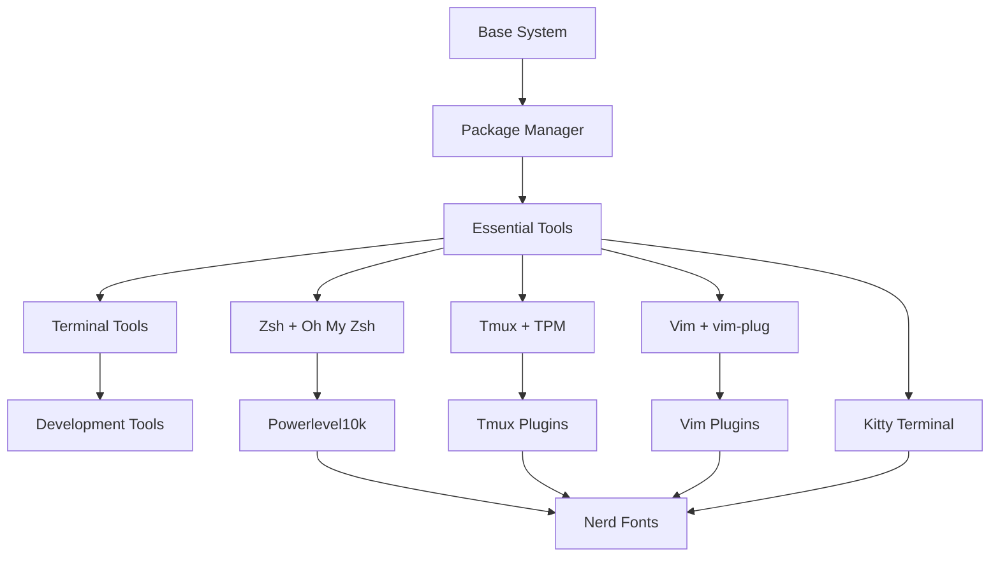

# Installation Guide

Complete installation instructions for setting up the dotfiles across different platforms.

## Prerequisites

Before installing the dotfiles, ensure you have:

- Git (2.0 or later)
- Curl
- Administrative privileges (sudo/admin access)
- Terminal with 256 color support
- Internet connection for downloading dependencies

## 🌍 Supported Platforms

| Platform | Versions | CI Testing | Setup Script | Package Manager |
|----------|----------|------------|--------------|-----------------|
| **Ubuntu** | 22.04, 24.04 LTS | ✅ Automated | `setup-ubuntu.sh` | apt + snap |
| **macOS** | 14+ (Sonoma+) | ✅ Automated | `setup-macos.sh` | Homebrew |
| **Fedora** | Latest rolling | ✅ Automated | `setup-fedora.sh` | dnf + flatpak |
| **Arch Linux** | Rolling release | ✅ Automated | `setup-arch.sh` | pacman + yay |
| **Debian** | 11+ (Bullseye+) | 🟡 Compatible | Ubuntu script | apt |

### 🧪 CI/CD Validation
All platforms are automatically tested on every commit using GitHub Actions with:
- Container-based testing for Linux distributions
- Native macOS runners for Apple ecosystem
- Comprehensive 17-test validation suite
- Security scanning with multiple tools

## Before Installation

### Backup Existing Configurations

The installer will automatically backup your existing dotfiles, but manual backup is recommended:

```bash
# Backup important configs
cp ~/.zshrc ~/.zshrc.backup
cp ~/.vimrc ~/.vimrc.backup
cp ~/.tmux.conf ~/.tmux.conf.backup
cp -r ~/.config ~/.config.backup
```

### Check Current Shell

```bash
echo $SHELL
# If not using zsh, the installer will offer to change it
```

## 🚀 Installation Methods

### 🎯 Method 1: Interactive New Machine Setup (Recommended)

**Perfect for:** New systems, first-time users, or complete setups

```bash
# Clone the repository
git clone https://github.com/heinsteinh/dotfiles.git ~/.dotfiles
cd ~/.dotfiles

# Run the interactive setup wizard
./tools/workflows/new-machine.sh
```

**What the wizard does:**
1. **🔍 OS Detection**: Automatically identifies your platform
2. **👤 User Setup**: Prompts for Git user name and email
3. **📦 Installation Type**: Choose between minimal or full installation
4. **⚙️ Platform Setup**: Runs appropriate OS-specific scripts
5. **🔗 Configuration**: Creates symlinks and configures tools
6. **✅ Validation**: Tests the installation

### 🛠️ Method 2: Direct Platform-Specific Installation

**Perfect for:** Advanced users, automation, or specific platform needs

```bash
# Clone first
git clone https://github.com/heinsteinh/dotfiles.git ~/.dotfiles && cd ~/.dotfiles

# Choose your platform:
./scripts/setup/setup-ubuntu.sh    # Ubuntu/Debian systems
./scripts/setup/setup-macos.sh     # macOS systems  
./scripts/setup/setup-fedora.sh    # Fedora systems
./scripts/setup/setup-arch.sh      # Arch Linux systems

# Then create symlinks
./scripts/utils/create-symlinks.sh
```

### 🧪 Method 3: Testing & Development

**Perfect for:** Contributors, testers, or validation

```bash
# Full installation with testing
git clone https://github.com/heinsteinh/dotfiles.git ~/.dotfiles && cd ~/.dotfiles
./tools/workflows/new-machine.sh

# Run comprehensive tests
./tests/test-installation.sh --verbose

# Individual component testing  
./scripts/install/install-fonts.sh
./tests/test-installation.sh --skip-interactive
```

### First-Time Setup

After installation:

1. **Restart your terminal**
2. **Configure Powerlevel10k**: Run `p10k configure`
3. **Install tmux plugins**: In tmux, press `Ctrl+a` then `I`
4. **Install vim plugins**: Open vim and run `:PlugInstall`
5. **Verify installation**: Run `make test` (if available)

## Architecture

### Directory Structure

```
dotfiles/
├── README.md                    # This file
├── install.sh                   # Main installer
├── Makefile                     # Installation targets
│
├── config/                      # Configuration files
│   ├── vim/
│   │   ├── .vimrc              # Vim configuration
│   │   └── plugins.vim         # Plugin definitions
│   ├── tmux/
│   │   ├── .tmux.conf          # Tmux configuration
│   │   └── scripts/            # Tmux scripts
│   ├── kitty/
│   │   ├── kitty.conf          # Kitty terminal config
│   │   └── themes/             # Color schemes
│   ├── zsh/
│   │   ├── .zshrc              # Main zsh config
│   │   ├── aliases.zsh         # Command aliases
│   │   ├── functions.zsh       # Custom functions
│   │   └── exports.zsh         # Environment variables
│   └── git/
│       ├── .gitconfig          # Git configuration
│       └── .gitignore_global   # Global gitignore
│
├── scripts/                     # Installation scripts
│   ├── setup-arch.sh          # Arch Linux setup
│   ├── setup-macos.sh         # macOS setup
│   ├── install-fonts.sh       # Font installation
│   ├── install-cli-tools.sh   # CLI tools
│   └── backup-dotfiles.sh     # Backup script
│
├── fonts/                       # Font files
│   ├── MesloLGS/
│   ├── FiraCode/
│   └── JetBrainsMono/
│
└── docs/                        # Documentation
    ├── INSTALL.md              # Installation guide
    ├── CUSTOMIZATION.md        # Customization guide
    └── TROUBLESHOOTING.md      # Common issues
```

### Component Dependencies



## Installation Guide

### Platform-Specific Setup

#### Arch Linux

The Arch setup script installs:

```bash
# System packages
pacman -S base-devel git curl wget zsh tmux vim neovim
pacman -S fzf ripgrep fd exa bat htop python nodejs npm

# AUR packages (via yay)
yay -S kitty lazygit bottom starship zoxide
```

#### macOS

The macOS setup uses Homebrew:

```bash
# Essential tools
brew install git curl wget zsh tmux vim neovim
brew install fzf ripgrep fd exa bat htop python3 node

# GUI applications
brew install --cask kitty font-meslo-lg-nerd-font

# Additional tools
brew install lazygit bottom starship zoxide
```

#### Ubuntu/Debian

For Ubuntu/Debian systems:

```bash
# Update package list
sudo apt update

# Install essential packages
sudo apt install build-essential git curl wget zsh tmux vim
sudo apt install python3 python3-pip nodejs npm

# Install from source (newer versions)
# FZF, ripgrep, exa, bat - follow official installation guides
```

### Font Installation

The font installer supports multiple Nerd Fonts:

- **MesloLGS NF**: Primary font, optimized for Powerlevel10k
- **FiraCode NF**: Programming font with ligatures
- **JetBrains Mono NF**: Modern monospace font
- **Hack NF**: Classic programming font

Installation locations:
- **macOS**: `~/Library/Fonts/`
- **Linux**: `~/.local/share/fonts/`

## Configuration Details

### Zsh Configuration

#### Features
- **Oh My Zsh** framework with curated plugins
- **Powerlevel10k** theme for informative prompt
- **Auto-suggestions** for command completion
- **Syntax highlighting** for better readability
- **History optimization** with deduplication
- **Cross-platform aliases** and functions

#### Key Plugins
```bash
plugins=(
    git                    # Git aliases and functions
    zsh-autosuggestions   # Command suggestions
    zsh-syntax-highlighting # Syntax coloring
    fzf                   # Fuzzy finder integration
    docker                # Docker completions
    sudo                  # ESC ESC for sudo
)
```

#### Custom Functions
- `mkcd()`: Create directory and cd into it
- `extract()`: Universal archive extraction
- `fkill()`: Interactive process killer with fzf
- `weather()`: Get weather information
- `backup()`: Quick file backup

### Vim Configuration

#### Plugin Categories

**File Management**
- `fzf.vim`: Fuzzy file finding
- `nerdtree`: File tree explorer
- `vim-devicons`: File type icons

**Git Integration**
- `vim-fugitive`: Git commands in vim
- `vim-gitgutter`: Git diff indicators
- Custom git shortcuts

**Code Enhancement**
- `ale`: Asynchronous linting
- `vim-commentary`: Easy commenting
- `vim-surround`: Manipulate surroundings
- `auto-pairs`: Automatic bracket pairing

**Visual Enhancements**
- `vim-airline`: Status line
- `gruvbox`: Color scheme
- `indentLine`: Indent guides

#### Key Mappings Philosophy

All custom mappings use `Space` as the leader key for consistency:

**File Operations**
- `<leader>f`: Find files
- `<leader>w`: Save file
- `<leader>q`: Quit

**Search & Replace**
- `<leader>rg`: Search in files
- `<leader>sr`: Search and replace
- `<leader>/`: Clear search highlight

**Git Operations**
- `<leader>gs`: Git status
- `<leader>gc`: Git commit
- `<leader>gd`: Git diff

### Tmux Configuration

#### Design Principles
- **Vim-like navigation** with hjkl keys
- **Intuitive splitting** with | and - keys
- **Session management** with easy switching
- **Status bar optimization** for development info

#### Plugin Management
Uses TPM (Tmux Plugin Manager) for:
- `tmux-resurrect`: Session persistence
- `tmux-continuum`: Automatic session saving
- `vim-tmux-navigator`: Seamless vim/tmux navigation
- `tmux-yank`: Enhanced copy/paste

#### Custom Keybindings
- **Prefix**: `Ctrl+a` (instead of default Ctrl+b)
- **Split vertical**: `|`
- **Split horizontal**: `-`
- **Pane navigation**: `h/j/k/l`
- **Window switching**: `Alt+H/L`

### Kitty Terminal

#### Performance Features
- **GPU acceleration** for smooth scrolling
- **Optimized font rendering** with Nerd Font support
- **Fast startup time** with minimal plugins
- **Efficient memory usage**

#### Visual Configuration
- **Gruvbox color scheme** matching other tools
- **Transparent background** option
- **Customizable tab bar**
- **Ligature support** for programming fonts

#### Integration Features
- **Shell integration** for enhanced features
- **Image display** capability
- **Hyperlink support**
- **Unicode support** for international characters

## Customization

### Local Configuration Files

Create these files for personal customizations without modifying the main configs:

```bash
~/.zshrc.local          # Local zsh settings
~/.vimrc.local          # Local vim settings
~/.tmux.conf.local      # Local tmux settings
~/.gitconfig.local      # Local git settings
```

### Color Scheme Customization

#### Changing Vim Theme
```vim
" In ~/.vimrc.local
colorscheme dracula
let g:airline_theme = 'dracula'
```

#### Available Themes
- `gruvbox` (default): Warm, retro color scheme
- `dracula`: Dark theme with purple accents
- `nord-vim`: Arctic, north-bluish color palette

#### Kitty Theme
```bash
# In ~/.config/kitty/kitty.conf.local
include themes/dracula.conf
```

### Adding Custom Aliases

```bash
# In ~/.zshrc.local
alias myproject='cd ~/Projects/my-project'
alias serve='python3 -m http.server'
alias myip='curl ifconfig.me'
```

### Extending Vim Functionality

```vim
" In ~/.vimrc.local
Plug 'tpope/vim-rails'        " Rails support
Plug 'fatih/vim-go'           " Go development

" Custom mappings
nnoremap <leader>t :TestNearest<CR>
```

### Custom Tmux Sessions

```bash
# Create session templates
tmux new-session -d -s dev -c ~/Projects
tmux split-window -h -c ~/Projects
tmux split-window -v -c ~/Projects
```

## Troubleshooting

### Common Issues and Solutions

#### Fonts Not Displaying Correctly

**Symptoms**: Missing icons, broken symbols, square boxes
**Solution**:
```bash
# Reinstall fonts
./scripts/install-fonts.sh

# Clear font cache (Linux)
fc-cache -fv

# Verify font installation
fc-list | grep -i "meslo\|nerd"
```

#### Zsh Plugins Not Loading

**Symptoms**: No auto-suggestions, missing syntax highlighting
**Solution**:
```bash
# Reinstall Oh My Zsh
sh -c "$(curl -fsSL https://raw.github.com/ohmyzsh/ohmyzsh/master/tools/install.sh)"

# Install plugins manually
git clone https://github.com/zsh-users/zsh-autosuggestions ~/.oh-my-zsh/custom/plugins/zsh-autosuggestions
git clone https://github.com/zsh-users/zsh-syntax-highlighting ~/.oh-my-zsh/custom/plugins/zsh-syntax-highlighting

# Reload configuration
source ~/.zshrc
```

#### Tmux Plugins Not Working

**Symptoms**: Status bar not showing, key bindings not working
**Solution**:
```bash
# Install TPM
git clone https://github.com/tmux-plugins/tpm ~/.tmux/plugins/tpm

# Install plugins (in tmux session)
tmux source ~/.tmux.conf
# Press Ctrl+a + I to install plugins
```

#### Vim Plugins Failing

**Symptoms**: PlugInstall errors, missing functionality
**Solution**:
```bash
# Update vim-plug
curl -fLo ~/.vim/autoload/plug.vim --create-dirs \
    https://raw.githubusercontent.com/junegunn/vim-plug/master/plug.vim

# Clean and reinstall plugins
vim +PlugClean +PlugInstall +qall
```

#### Performance Issues

**Slow zsh startup**:
```bash
# Profile startup time
time zsh -i -c exit

# Disable plugins temporarily to identify culprit
# Comment out plugins in .zshrc
```

**Vim lag with large files**:
```vim
" Add to .vimrc.local for large files
autocmd BufReadPre * if getfsize(expand("%")) > 10000000 | syntax off | endif
```

### Debugging Tools

#### Zsh Debugging
```bash
# Verbose startup
zsh -xvs

# Check plugin loading
echo $fpath
```

#### Vim Debugging
```vim
:checkhealth          " Neovim health check
:PlugStatus           " Check plugin status
:messages             " View error messages
```

#### Tmux Debugging
```bash
# Check tmux configuration
tmux source ~/.tmux.conf

# List sessions and windows
tmux list-sessions
tmux list-windows
```

## CLI Tools Reference

### File Operations

#### exa (Enhanced ls)
```bash
exa -la --git              # List with git status
exa --tree                 # Tree view
exa -la --sort=modified    # Sort by modification time
exa --icons               # Show file type icons
```

#### fd (Enhanced find)
```bash
fd pattern                 # Find files/directories
fd -e py                   # Find Python files
fd -t d pattern           # Find directories only
fd -H pattern             # Include hidden files
```

#### bat (Enhanced cat)
```bash
bat file.py               # Syntax highlighted output
bat -A file.txt           # Show all characters
bat --style=grid          # Add grid lines
bat file1 file2           # Multiple files
```

### Text Processing

#### ripgrep (rg)
```bash
rg "pattern"              # Search current directory
rg -i "pattern"           # Case insensitive
rg --type py "pattern"    # Search only Python files
rg -A 3 -B 3 "pattern"    # Show 3 lines before/after
```

#### fzf (Fuzzy Finder)
```bash
fzf                       # Interactive file finder
history | fzf             # Search command history
ls | fzf                  # Filter any input
vim $(fzf)                # Open selected file in vim
```

### System Monitoring

#### htop/btop
```bash
htop                      # Interactive process viewer
btop                      # Modern system monitor
htop -u username          # Show processes for user
```

#### System Information
```bash
neofetch                  # System information
df -h                     # Disk usage
free -h                   # Memory usage
lscpu                     # CPU information
```

### Development Tools

#### Git with lazygit
```bash
lazygit                   # Terminal UI for git
git log --oneline --graph # Pretty git log
git status -sb            # Short status
```

#### Docker
```bash
docker ps                 # Running containers
docker images             # List images
docker logs -f container  # Follow logs
```

### Network Tools

#### Basic Network Commands
```bash
curl ifconfig.me          # Get public IP
wget -O- url              # Download to stdout
httpie get api.url.com    # HTTP client
```

#### Network Monitoring
```bash
ss -tuln                  # Network connections
netstat -i                # Network interfaces
ping -c 4 google.com      # Test connectivity
```

## Keybindings Reference

### Global Concepts

- **Leader Key**: `Space` (vim), `Ctrl+a` (tmux)
- **Navigation**: Vim-style `hjkl` movement
- **Fuzzy Finding**: `Ctrl+t` (files), `Ctrl+r` (history)

### Zsh Keybindings

| Key | Action |
|-----|--------|
| `Ctrl+r` | Search command history |
| `Ctrl+t` | Find files with fzf |
| `Alt+c` | Change directory with fzf |
| `Ctrl+l` | Clear screen |
| `Ctrl+a` | Move to beginning of line |
| `Ctrl+e` | Move to end of line |
| `Ctrl+w` | Delete word backward |
| `Alt+.` | Insert last argument |

### Vim Keybindings

#### Normal Mode
| Key | Action |
|-----|--------|
| `<leader>f` | Find files (FZF) |
| `<leader>b` | List buffers |
| `<leader>rg` | Search in files |
| `<leader>n` | Toggle NERDTree |
| `<leader>gs` | Git status |
| `<leader>w` | Save file |
| `<leader>q` | Quit |

#### Navigation
| Key | Action |
|-----|--------|
| `<leader>s` | Jump to character (EasyMotion) |
| `<leader>w` | Jump to word (EasyMotion) |
| `Ctrl+h/j/k/l` | Navigate windows |
| `Ctrl+w + |` | Maximize window horizontally |
| `Ctrl+w + _` | Maximize window vertically |

#### Search & Replace
| Key | Action |
|-----|--------|
| `/` | Enhanced search |
| `z/` | Fuzzy search |
| `<leader>*` | Search word under cursor |
| `<leader>sr` | Search and replace |
| `<leader>/` | Clear search highlight |

### Tmux Keybindings

#### Session Management
| Key | Action |
|-----|--------|
| `Ctrl+a + s` | List sessions |
| `Ctrl+a + $` | Rename session |
| `Ctrl+a + d` | Detach session |

#### Window Management
| Key | Action |
|-----|--------|
| `Ctrl+a + c` | New window |
| `Ctrl+a + &` | Kill window |
| `Ctrl+a + ,` | Rename window |
| `Ctrl+a + n/p` | Next/previous window |
| `Alt+H/L` | Switch windows |

#### Pane Management
| Key | Action |
|-----|--------|
| `Ctrl+a + \|` | Split vertically |
| `Ctrl+a + -` | Split horizontally |
| `Ctrl+a + h/j/k/l` | Navigate panes |
| `Ctrl+a + H/J/K/L` | Resize panes |
| `Ctrl+a + x` | Kill pane |

### Kitty Keybindings

#### Tab Management
| Key | Action |
|-----|--------|
| `Ctrl+Shift+t` | New tab |
| `Ctrl+Shift+q` | Close tab |
| `Ctrl+Shift+right/left` | Switch tabs |
| `Ctrl+Shift+.` | Move tab forward |

#### Window Management
| Key | Action |
|-----|--------|
| `Ctrl+Shift+n` | New window |
| `Ctrl+Shift+w` | Close window |
| `Ctrl+Shift+]` | Next window |
| `Ctrl+Shift+[` | Previous window |

#### Utility
| Key | Action |
|-----|--------|
| `Ctrl+Shift+c` | Copy |
| `Ctrl+Shift+v` | Paste |
| `Ctrl+Shift+f` | Search |
| `Ctrl+Shift+f11` | Toggle fullscreen |

## Maintenance

### Regular Updates

#### Weekly Maintenance
```bash
# Update system packages
make update-system

# Update vim plugins
vim +PlugUpdate +qall

# Update tmux plugins
tmux run '~/.tmux/plugins/tpm/bin/update_plugins all'
```

#### Monthly Maintenance
```bash
# Clean vim plugins
vim +PlugClean +qall

# Update Oh My Zsh
omz update

# Clean package cache (Arch)
sudo pacman -Sc

# Clean Homebrew (macOS)
brew cleanup
```

### Backup Strategy

#### Automated Backups
```bash
# Create backup before updates
make backup

# Backup with custom name
./scripts/backup-dotfiles.sh --name "before-update"
```

#### Version Control
```bash
# Track your customizations
cd ~/.dotfiles
git add config/local/
git commit -m "Update local configurations"
git push origin main
```

### Health Checks

#### System Health
```bash
# Check all tools are working
make health-check

# Individual component checks
which vim tmux zsh git fzf
```

#### Configuration Validation
```bash
# Zsh configuration check
zsh -n ~/.zshrc

# Vim configuration check
vim --cmd "try | source ~/.vimrc | catch | cquit | endtry" +qall

# Tmux configuration check
tmux source ~/.tmux.conf
```

## Advanced Usage

### Workflow Integration

#### Project Management
```bash
# Project-specific tmux sessions
create-project-session() {
    local project_name=$1
    tmux new-session -d -s "$project_name" -c ~/Projects/"$project_name"
    tmux split-window -h -c ~/Projects/"$project_name"
    tmux split-window -v -c ~/Projects/"$project_name"
    tmux select-pane -t 0
    tmux attach-session -t "$project_name"
}
```

#### Git Workflows
```bash
# Enhanced git aliases in .zshrc
alias gfp='git fetch && git pull'
alias gcm='git checkout main && git pull'
alias gbd='git branch -d'
alias glog='git log --oneline --graph --decorate --all'
```

#### Development Shortcuts
```bash
# Quick development server
serve() {
    local port=${1:-8000}
    python3 -m http.server $port
}

# Quick documentation lookup
doc() {
    curl "cheat.sh/$1"
}
```

### Custom Scripts

#### Session Manager
```bash
#!/bin/bash
# ~/.local/bin/tm - tmux session manager

sessions=$(tmux list-sessions -F "#S" 2>/dev/null)
if [ -z "$sessions" ]; then
    tmux new-session
else
    session=$(echo "$sessions" | fzf --prompt="Select session: ")
    if [ -n "$session" ]; then
        tmux attach-session -t "$session"
    fi
fi
```

#### Project Finder
```bash
#!/bin/bash
# ~/.local/bin/pf - project finder

project=$(find ~/Projects -maxdepth 2 -type d -name ".git" \
    | xargs dirname \
    | fzf --prompt="Select project: ")

if [ -n "$project" ]; then
    cd "$project"
    if command -v code &> /dev/null; then
        code .
    fi
fi
```

### Performance Optimization

#### Zsh Optimization
```bash
# Lazy loading for slow commands
lazy_load_nvm() {
    unset -f nvm node npm
    export NVM_DIR="$HOME/.nvm"
    [ -s "$NVM_DIR/nvm.sh" ] && . "$NVM_DIR/nvm.sh"
}
nvm() { lazy_load_nvm; nvm $@ }
node() { lazy_load_nvm; node $@ }
npm() { lazy_load_nvm; npm $@ }
```

#### Vim Optimization
```vim
" Lazy loading for heavy plugins
augroup load_us_ycm
    autocmd!
    autocmd InsertEnter * call plug#load('YouCompleteMe')
                \| autocmd! load_us_ycm
augroup END
```

## Contributing

### Development Setup

1. **Fork the repository**
2. **Create a feature branch**
   ```bash
   git checkout -b feature/new-feature
   ```
3. **Test on multiple platforms**
4. **Update documentation**
5. **Submit pull request**

### Testing Guidelines

#### Platform Testing
- Test on Arch Linux and macOS minimum
- Verify all keybindings work
- Check color schemes render correctly
- Ensure fonts display properly

#### Documentation Testing
```bash
# Test all code examples
shellcheck scripts/*.sh
```

### Code Style

#### Shell Scripts
- Use `#!/bin/bash` shebang
- Enable strict mode: `set -euo pipefail`
- Quote variables: `"$variable"`
- Use functions for reusable code

#### Vim Configuration
- Group related settings
- Comment complex configurations
- Use consistent indentation
- Test with minimal vim installation

### Contribution Areas

1. **New tool integrations**
2. **Performance improvements**
3. **Additional platform support**
4. **Documentation improvements**
5. **Bug fixes and testing**

---

This comprehensive documentation serves as both a user guide and reference manual for maintaining and extending the dotfiles configuration. Regular updates to this documentation ensure it remains current with the evolving toolset and best practices.
